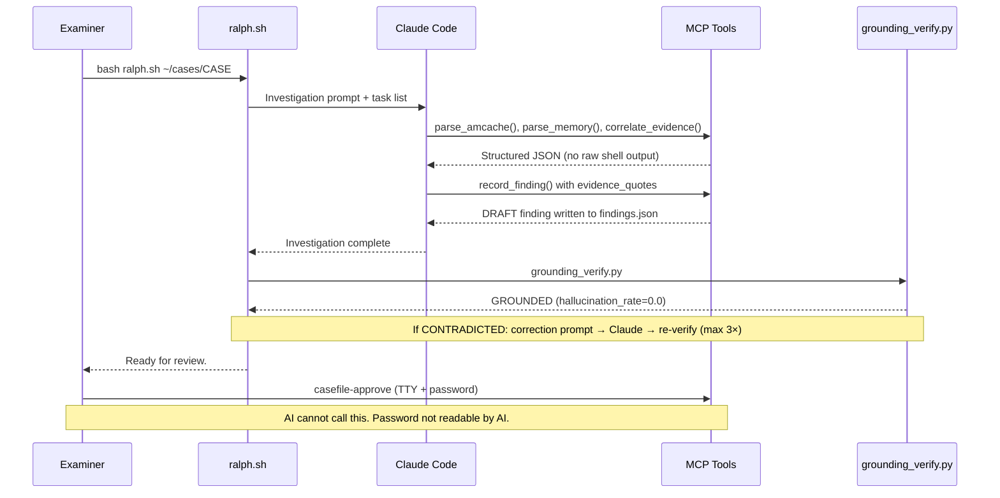
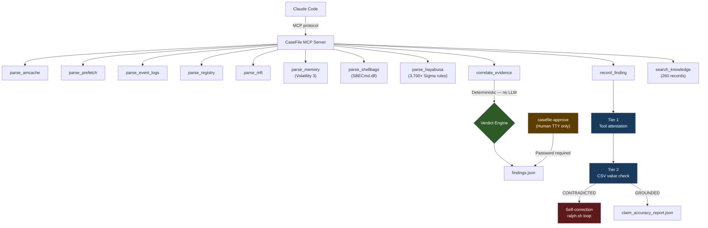

# CaseFile

[](https://github.com/nurusyda/casefile/actions/workflows/ci.yml)
[](https://github.com/nurusyda/casefile/blob/main/LICENSE)

**Autonomous forensic investigation for Claude Code on SIFT Workstation.**

CaseFile gives Claude Code structured access to Windows forensic artifact parsers, a
deterministic cross-source correlation engine, and an 11-layer anti-hallucination stack
that verifies every claim against actual tool output — and self-corrects when verification
fails.

Built for the SANS Find Evil Hackathon 2026. Tested against the SRL-2018 CRIMSON OSPREY
case (real SANS FOR508 challenge evidence, base-rd-01-cdrive.E01, 17 GB).

> **Important Note** — CaseFile is an autonomous investigation assistant, not a replacement
> for examiner judgment. Always verify results. The AI accelerates analysis — the human
> must direct the investigation and approve every finding before it appears in any report.

---

## The Self-Correction Story

On our May 18, 2026 investigation run:

1. Claude Code ran autonomously and produced 6 findings (5 CONFIRMED, 1 INFERRED)
2. Post-completion grounding verification detected **19 contradicted claims** — hallucination rate: **1.0**
3. The self-correction loop fired automatically, sending a targeted correction prompt back to Claude Code
4. After **1 correction iteration**: hallucination rate dropped to **0.0**, contradicted claims = 0
5. No human intervention at any point during correction

This is the core claim of CaseFile: not that the AI never hallucinates, but that the
architecture catches and corrects hallucinations before they reach the examiner.

See `reports/ralph_run_may18_selfcorrection.log` for the full run log.

---

## Accuracy (Self-Assessed)

CaseFile defines accuracy checkpoints using CFA-Bench methodology. These are
**our own checkpoints**, not official judge checkpoints. The Protocol SIFT baseline
is our own manual run of Protocol SIFT against the same evidence — not a controlled
third-party study.

| Checkpoint | CaseFile | Protocol SIFT (our baseline) |
|---|---|---|
| CP1: Primary persistence mechanism identified | PASS | PASS |
| CP2: Masquerading process with execution path | PASS | FAIL |
| CP3: Credential dumping tool + account linkage | PASS | FAIL |
| CP4: C2 beaconing from memory analysis | PASS | FAIL |
| CP5: Timestomping (SI < FN timestamps) | PASS | FAIL |
| CP6: Anti-forensics evidence | PASS | PASS |
| CP7: Cross-source correlation (4 artifact sources) | PASS | FAIL |
| CP8: Hex-named payload identification | PASS | FAIL |
| **Score** | **8/8** | **2/8** |

*CP4 and CP7 are architectural failures for Protocol SIFT — it has no memory analysis
capability and cannot correlate across Amcache + Prefetch + MFT + Memory simultaneously.*

*Claim-level accuracy: 19 contradicted claims detected and self-corrected in 1 iteration.
Final hallucination rate: 0.0% (post-correction). Tier 2 CSV verification is implemented
and tested; confirmed firing in post-submission runs.*

Full report: [reports/accuracy_report_SRL2018.json](reports/accuracy_report_SRL2018.json)

---

## Investigation Workflow

```
1. Register evidence     →  hash the E01, establish chain of custody
2. Ingest artifacts      →  scripts/ingest.sh: E01 → parsed artifacts in ~2 min
3. Start investigation   →  ralph.sh launches Claude Code with MCP tools
4. Autonomous analysis   →  Claude runs parsers, correlates sources, writes DRAFT findings
5. Grounding check       →  grounding_verify.py validates every claim against tool output
6. Self-correction       →  CONTRADICTED claims trigger targeted re-prompt (max 3×)
7. Human review          →  casefile-approve: examiner reads findings, types password, approves
8. Generate report       →  scripts/generate_html_report.py: dark-theme HTML report
```

Steps 5–6 are what distinguish CaseFile from a standard LLM forensic loop.

### Sequence: From Evidence to Approved Finding



---

## Architecture



### Architectural vs. Prompt-Based Guardrails

9 of 11 layers are enforced in code — the AI cannot bypass them regardless of what it writes.

| Layer | Guardrail | Type | What It Prevents |
|---|---|---|---|
| L1 | Structured JSON from all tools | **ARCH** | Free-form hallucination in tool output |
| L2 | CONFIRMED / INFERRED labeling | **ARCH** | Overconfident unsupported claims |
| L3 | Deterministic verdict engine | **ARCH** | LLM inventing correlation outcomes |
| L4 | Append-only audit trail | **ARCH** | Unattributed or untraced findings |
| L5 | Human approve gate (TTY + password) | **ARCH** | AI self-approving its own findings |
| L6 | Two-stage code review (monster_check + CodeRabbit) | PROCESS | Hallucination vectors introduced in code |
| L7 | Path confinement (CASEFILE_CASE_ROOT) | **ARCH** | Reading evidence outside case directory |
| L8 | Evidence quotes (exact CSV cell values) | **ARCH** | Paraphrasing that changes forensic meaning |
| L9 | Tier 1 grounding (invocation ID check) | **ARCH** | Claims not traceable to actual tool calls |
| L10 | Tier 2 grounding (CSV value check) | **ARCH** | Correct tool called, but wrong value cited |
| L11 | Grounded self-correction loop | PROCESS | Persistent hallucinations surviving one pass |

Full detail: [docs/guardrails.md](docs/guardrails.md)

### Cross-Source Correlation

`correlate_evidence()` makes decisions deterministically — zero LLM involvement:

| Sources Present | Verdict |
|---|---|
| Memory + (Amcache OR Prefetch OR MFT) | `CONFIRMED_RUNNING` |
| No memory + 2+ disk sources | `CONFIRMED_HISTORICAL` |
| Memory only, no disk source | `MEMORY_ONLY` |
| Amcache only | `INSTALLED_NEVER_RAN` |
| Nothing found | `NOT_FOUND` |

`detect_contradictions()` additionally flags:

- Execution timestamp before file creation → timestomping (T1070.006)
- Memory-only process with no disk artifact → fileless malware (T1055)
- Amcache path ≠ MFT path for same binary → DLL sideloading (T1574.001)

### Two-Tier Grounding

**Tier 1** — every `invocation_id` in `evidence_quotes` must exist in `audit/mcp.jsonl`
with a matching tool name. Catches fabricated tool calls.

**Tier 2** — opens the actual CSV output file and verifies the `exact_value` cited in
`evidence_quotes` exists as a literal field value in the data. Catches correct tool,
wrong value. Fires when `csv_files` is present in the audit entry (Amcache, Registry,
Event Logs, MFT, Hayabusa).

### Human Approval Gate

`casefile-approve` is a standalone CLI entrypoint — not an MCP tool:

- Requires a real TTY — fails in non-interactive shells
- Requires password via `getpass()` — no echo, not readable by the AI
- NOT registered in `mcp_server/server.py` — Claude cannot invoke it under any circumstances
- Writes SHA-256 content hash to `approvals.jsonl` at approval time

---

## MCP Tools (15 registered)

| Tool | File | Description |
|---|---|---|
| `parse_amcache()` | amcache.py | SHA1 hashes, execution history, first-seen timestamps |
| `parse_prefetch()` | prefetch.py | Execution counts, last run times (pyscca library) |
| `parse_event_logs()` | event_logs.py | EVTX parsing — EIDs 4624, 4648, 7045, 1102, etc. |
| `parse_registry()` | registry.py | Hive parsing — Run keys, services, UserAssist |
| `parse_mft()` | mft.py | MFT timestamps, SI<FN timestomping detection |
| `parse_memory()` | memory.py | Volatility 3 — pslist, psscan, netscan, cmdline, malfind |
| `parse_shellbags()` | shellbags.py | Folder access history via SBECmd.dll — attacker recon |
| `parse_hayabusa()` | hayabusa.py | Sigma rule detection, 3,700+ rules against EVTX |
| `correlate_evidence()` | correlation.py | 4-source verdict engine + contradiction detection |
| `record_finding()` | findings.py | Stage finding with evidence quotes and grounding |
| `get_findings()` | findings.py | Retrieve findings with optional status filter |
| `record_timeline_event()` | findings.py | Add event to investigation timeline |
| `generate_accuracy_report()` | accuracy.py | CFA-Bench checkpoint scoring |
| `search_knowledge()` | forensic_rag.py | Forensic RAG — 260 records, TF-IDF search |
| `get_knowledge_stats()` | forensic_rag.py | RAG index statistics |

### Forensic Knowledge Reinforcement

`search_knowledge()` provides 260 curated records covering:

- 51 MITRE ATT&CK techniques with Windows-specific detection guidance
- 22 artifact analysis guides (Prefetch, Amcache, MFT, Registry, Memory, Shellbags, etc.)
- 20 investigation methodology entries
- 18 Sigma detection rules
- 9 LOLBAS entries, 8 Windows Event ID references, 7 threat intelligence entries

Zero external dependencies — pure TF-IDF keyword search, no PyTorch or CUDA required.

---

## What CaseFile Found (SRL-2018, BASE-RD-01)

| Finding | Confidence | Evidence Sources | ATT&CK |
|---|---|---|---|
| CSRSS.EXE masquerading from `\Windows\Temp\Perfmon` | CONFIRMED | Amcache + MFT + Memory (PID 4048) | T1036.005 |
| procdump.exe credential dumping (Dashlane path, SHA1 verified) | CONFIRMED | Prefetch + Amcache | T1003.001 |
| LARIAT + Cobalt Strike services installed (Event ID 7045) | CONFIRMED | Event Logs | T1543.003 |
| subject_srv.exe timestomped (SI 2018-01-15, FN 2018-03-22) | CONFIRMED | MFT SI<FN flag | T1070.006 |
| p.exe (PID 8260) live at acquisition, WMI execution chain | CONFIRMED | Memory pslist + netscan | T1047 |
| C2 activity to 172.16.6.12 | INFERRED | Event Logs (NTLM) | T1071 |

*Findings from our May 18, 2026 investigation run. The SRL-2018 case has official ground
truth IOCs that may differ. Our checkpoints measure investigation depth and corroboration
quality, not exhaustiveness.*

---

## Quick Start

### Prerequisites

| Dependency | Version | Notes |
|---|---|---|
| SIFT Workstation | Ubuntu 22.04 | [SIFT Workstation](https://www.sans.org/tools/sift-workstation/) |
| Python | 3.10+ | Pre-installed on SIFT |
| EZ Tools | latest | `/opt/zimmermantools/` — installed by `bash setup-sift.sh` |
| Volatility 3 | latest | `pip install volatility3 --break-system-packages` |
| Hayabusa | v3.9.0+ | Binary at `/usr/local/bin/hayabusa`, rules at `/opt/hayabusa-rules` |
| Claude Code | latest | [claude.ai/code](https://claude.ai/code) |

### Install

```bash
git clone https://github.com/nurusyda/casefile.git
cd casefile
pip install -e . --break-system-packages
```

Or use the SIFT setup script (installs EZ Tools, Hayabusa, and all Python dependencies):

```bash
bash setup-sift.sh
```

### Run an Investigation

```bash
# Step 1: Extract artifacts from E01 (~2 min)
bash scripts/ingest.sh /path/to/evidence.E01 CASE_NAME

# Step 2: Set environment
export CASEFILE_CASE_ROOT=~/cases/CASE_NAME
export CASEFILE_CASE_DIR=~/cases/CASE_NAME
export CASEFILE_EXAMINER=your_name

# Step 3: Start the MCP server (background or separate terminal)
python3 -m mcp_server.server

# Step 4: Run autonomous investigation via Claude Code
bash ralph.sh ~/cases/CASE_NAME

# Step 5: Review and approve findings (requires TTY + password)
casefile-approve

# Step 6: Generate report
python3 scripts/generate_html_report.py
```

### Environment Variables

| Variable | Required | Default | Purpose |
|---|---|---|---|
| `CASEFILE_CASE_ROOT` | Yes | — | Base path. All tool paths are validated against this. |
| `CASEFILE_CASE_DIR` | Yes | — | Active case directory for findings.json and audit log |
| `CASEFILE_EXAMINER` | Recommended | `casefile` | Embedded in all finding IDs and audit records |

---

## How It Works

### Evidence Extraction (`scripts/ingest.sh`)

- Mounts E01 via ewfmount (FUSE), auto-detects GPT or offset=0 (corrupted MBR)
- Extracts: SYSTEM/SOFTWARE/SECURITY/SAM hives, Amcache + LOG1/LOG2, Prefetch (.pf), Event Logs (.evtx), MFT ($MFT)
- Extracts user hives: NTUSER.DAT + UsrClass.dat per user → `analysis/user_hives/{username}/`
- Case-insensitive extraction (`find -iname`) — NTFS on Linux is case-sensitive
- SHA-256 hash of source image written to `source.sha256`
- Initializes `findings.json` and `audit/mcp.jsonl`

### Autonomous Investigation Loop (`ralph.sh`)

```
Investigation tasks → Claude Code → MCP tools → findings with evidence_quotes
                                                          ↓
                                              grounding_verify.py
                                                          ↓
                                GROUNDED → claim_accuracy_report.json
                             CONTRADICTED → correction prompt → Claude Code (max 3×)
```

The loop runs up to 25 investigation iterations. Rate limit detection exits cleanly
rather than burning quota on empty iterations.

### Case Directory Structure

```
~/cases/CASE_NAME/
├── source.sha256                    # SHA-256 of source E01 image
├── findings.json                    # All findings (DRAFT / APPROVED / REJECTED)
├── timeline.json                    # Investigation timeline events
├── iocs.md                          # IOCs (propagatable to other cases)
├── claim_accuracy_report.json       # Per-claim grounding results
├── analysis/
│   ├── amcache_out/                 # AmcacheParser CSV output
│   ├── prefetch/                    # Prefetch .pf files
│   ├── evtx/                        # Event Log .evtx files
│   ├── registry/                    # Registry hive files
│   ├── mft_out/                     # MFTECmd CSV output
│   ├── hayabusa/                    # Hayabusa CSV output (timestamped)
│   └── user_hives/{username}/       # NTUSER.DAT + UsrClass.dat per user
├── reports/
│   ├── report.md                    # Markdown IR report
│   └── report.html                  # Dark-theme HTML report
└── audit/
    └── mcp.jsonl                    # Append-only tool call log (every invocation)
```

---

## External Dependencies

| Dependency | Role | Location |
|---|---|---|
| [EZ Tools](https://ericzimmerman.github.io) | Windows artifact parsers (Amcache, MFT, Registry, EventLog, Shellbags) | `/opt/zimmermantools/` |
| [Volatility 3](https://github.com/volatilityfoundation/volatility3) | Memory forensics | Python package |
| [Hayabusa](https://github.com/Yamato-Security/hayabusa) | Sigma rule detection against EVTX | `/usr/local/bin/hayabusa` |
| [libscca / pyscca](https://github.com/libyal/libscca) | Prefetch parsing | Python package — graceful degradation if absent |
| [ewftools](https://github.com/libyal/libewf) | E01 mounting | `ewfmount` — pre-installed on SIFT |
| [Claude Code](https://claude.ai/code) | LLM client that drives the investigation | External |

No cloud services, no external APIs, and no network calls during investigation.
All analysis runs locally on the SIFT workstation.

---

## Evidence Integrity

| Mechanism | Implementation |
|---|---|
| Source hash | SHA-256 of E01 written at ingest to `source.sha256` |
| Write-blocked evidence | `.claude/settings.json` deny rules on `evidence/`, `audit/`, `approvals/` |
| Append-only audit log | `audit/mcp.jsonl` — every tool call logged with timestamps, return codes, invocation IDs |
| Approval hash | SHA-256 of finding content written to `approvals.jsonl` at approval time |
| Path confinement | All paths resolved and validated against `CASEFILE_CASE_ROOT` |
| Symlink rejection | All tool inputs reject symlinks — no traversal outside case root |
| Denial rules tests | `tests/test_settings.py` — 12 tests assert deny rules are present and correct |

---

## Tests

```bash
pytest tests/ -q
# 550 passed
```

Test coverage spans all 15 MCP tools, Tier 1 + Tier 2 grounding verifier, correlation
engine (verdict logic + contradiction detection), path confinement, deny rules, forensic
RAG, evidence quotes validation, audit log format, and correction prompt builder.

---

## Project Structure

```
casefile/
├── mcp_server/
│   ├── server.py                    # MCP server — 15 tools registered
│   └── tools/
│       ├── amcache.py               parse_amcache()
│       ├── prefetch.py              parse_prefetch()
│       ├── event_logs.py            parse_event_logs()
│       ├── registry.py              parse_registry()
│       ├── mft.py                   parse_mft()
│       ├── memory.py                parse_memory() — Volatility 3
│       ├── shellbags.py             parse_shellbags() — SBECmd.dll wrapper
│       ├── hayabusa.py              parse_hayabusa() — Sigma rule detection
│       ├── correlation.py           correlate_evidence() + detect_contradictions()
│       ├── findings.py              record_finding(), get_findings(), record_timeline_event()
│       ├── grounding.py             Tier 1/2 verification, source attestation
│       ├── forensic_rag.py          search_knowledge(), get_knowledge_stats()
│       └── accuracy.py              generate_accuracy_report() — CFA-Bench
├── scripts/
│   ├── ingest.sh                    E01 → ready in ~2 min (incl. user hives)
│   ├── grounding_verify.py          Post-run grounding check (exit 0/1/2)
│   ├── grounding_recheck.py         Correction loop re-check
│   ├── grounding_correction_prompt.py  Targeted correction prompt builder
│   ├── generate_report.py           Markdown IR report
│   ├── generate_html_report.py      Dark-theme HTML report
│   ├── generate_dataset_doc.py      Auto-generates docs/dataset.md
│   └── propagate_iocs.py            Cross-host IOC propagation
├── ralph.sh                         Autonomous investigation loop
├── CLAUDE.md                        Investigation laws for Claude Code
├── setup-sift.sh                    One-shot SIFT dependency installer
├── docs/
│   ├── guardrails.md                11-layer anti-hallucination detail
│   └── dataset.md                   Dataset documentation
├── reports/
│   ├── accuracy_report_SRL2018.json
│   └── ralph_run_may18_selfcorrection.log
└── tests/                           550 tests
```

---

## Required Resources

| Component | RAM (min) | Disk | Notes |
|---|---|---|---|
| SIFT Workstation + CaseFile | 8 GB | 50 GB + evidence | 16 GB recommended |
| With Volatility 3 memory analysis | 16 GB | 50 GB + evidence + memory image | Memory images typically 8–32 GB |
| EZ Tools + Hayabusa | — | ~500 MB | Installed by setup-sift.sh |
| Claude Code quota | — | — | ralph.sh runs consume ~5 hrs of daily Claude Code quota |

---

## Limitations (Honest Disclosure)

- **15 MCP tools vs. Valhuntir's 79** — CaseFile is deeper on anti-hallucination, not broader on tool coverage
- **260 RAG records vs. Valhuntir's 22,000** — functional for the SRL case, not a production knowledge base
- **Tier 2 grounding coverage** — only fires for tools that produce CSV output (Amcache, Registry, Event Logs, MFT, Hayabusa); Prefetch and Memory are Tier 1 only
- **Shellbags requires re-ingest** — NTUSER.DAT extraction was added after initial SRL-2018 ingest; existing case directories need `bash scripts/ingest.sh` re-run
- **No case management UI** — no Examiner Portal or browser interface; all interaction is CLI + Claude Code terminal
- **Single examiner only** — no multi-examiner export/merge workflow
- **Protocol SIFT baseline is our own run** — not a controlled third-party study
- **Not tested on a clean SIFT OVA** — setup-sift.sh has been validated incrementally, not from a fresh image end-to-end

---

## Evidence Handling

Never analyze original evidence directly. Only use working copies for which verified originals
or backups exist. Any data loaded onto the SIFT workstation may be transmitted to Anthropic
as part of Claude Code's normal operation. Treat the workstation as an analysis environment,
not evidence storage.

---

## Responsible Use

CaseFile is a tool for trained incident response professionals. The AI accelerates analysis;
the examiner is responsible for every approved finding. Use only on systems and data you are
authorized to analyze.

This software is provided "as is" without warranty. See [LICENSE](LICENSE) for terms.

MITRE ATT&CK® is a registered trademark of The MITRE Corporation.
SIFT Workstation is a product of the SANS Institute.

---

## Acknowledgments

Built for the SANS Find Evil Hackathon 2026.

## Clear Disclosure

I do DFIR. I am not a developer. This project would not exist without Claude Code handling
the implementation. An immense amount of effort has gone into architecture, CLAUDE.md
investigation laws, testing, and review — but I fully acknowledge I may have been working
hard and not smart in places. My intent is to demonstrate what grounded autonomous DFIR
investigation looks like when the AI is constrained by deterministic verification rather
than trusted by default.

---

## License

MIT. See [LICENSE](LICENSE).
