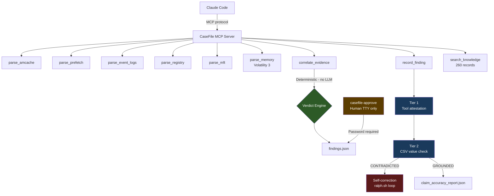

# CaseFile

**Autonomous forensic investigation for Claude Code on SIFT Workstation.**

CaseFile is a purpose-built MCP server that gives Claude Code structured access to
Windows forensic artifact parsers, a deterministic cross-source correlation engine,
and an 11-layer anti-hallucination stack that verifies every claim against actual
tool output -- and self-corrects when verification fails.

Built for the SANS Find Evil Hackathon 2026. Tested against the SRL-2018 CRIMSON
OSPREY case (real SANS FOR508 challenge evidence, base-rd-01-cdrive.E01, 17GB).

---

## The Self-Correction Story

On our May 18, 2026 investigation run:

1. Claude Code ran autonomously and produced 6 findings (5 CONFIRMED, 1 INFERRED)
2. Post-completion grounding verification detected **19 contradicted claims** -- hallucination rate: **1.0**
3. The self-correction loop fired automatically, sending a specific correction prompt back to Claude
4. After **1 correction iteration**: hallucination rate dropped to **0.0**, contradicted = 0
5. No human intervention at any point

This is the core claim of CaseFile: not that the AI never hallucinates, but that the
architecture catches and corrects hallucinations before they reach the examiner.

See `reports/ralph_run_may18_selfcorrection.log` for the full run log.

---

## Accuracy (Self-Assessed)

CaseFile defines accuracy checkpoints using CFA-Bench methodology. These are
**our own checkpoints**, not official judge checkpoints. The Protocol SIFT baseline
is our own manual run of Protocol SIFT against the same evidence -- not a controlled
study.

| Checkpoint | CaseFile | Protocol SIFT (our baseline) |
|---|---|---|
| CP1: Primary persistence mechanism identified | PASS | PASS |
| CP2: Masquerading process with execution path | PASS | FAIL |
| CP3: Credential dumping tool + account linkage | PASS | FAIL |
| CP4: C2 beaconing from memory analysis | PASS | FAIL |
| CP5: Timestomping (SI < FN timestamps) | PASS | FAIL |
| CP6: Anti-forensics evidence | PASS | PASS |
| CP7: Cross-source correlation (4 artifact sources) | PASS | FAIL |
| CP8: Hex-named payload identification | PASS | FAIL |
| **Score** | **8/8** | **2/8** |

*Protocol SIFT baseline = our manual Protocol SIFT investigation of the same image,
used as a reproducibility reference. Protocol SIFT has no memory analysis capability
(CP4 FAIL is architectural). CP7 FAIL is also architectural -- Protocol SIFT cannot
cross-correlate Amcache + Prefetch + MFT + Memory simultaneously.*

*Claim-level accuracy: 19 contradicted claims detected and self-corrected in 1 iteration.
Final hallucination rate: 0.0% (post-correction).*

Full report: [reports/accuracy_report_SRL2018.json](reports/accuracy_report_SRL2018.json)

---

## Architecture



### Architectural vs. Prompt-Based Guardrails

| Layer | Guardrail | Type | What It Prevents |
|---|---|---|---|
| L1 | Structured JSON from all tools | **ARCH** | Free-form hallucination |
| L2 | CONFIRMED / INFERRED labeling | **ARCH** | Overconfident claims |
| L3 | Deterministic verdict engine | **ARCH** | LLM inventing correlation outcomes |
| L4 | Append-only audit trail | **ARCH** | Unattributed findings |
| L5 | Human approve gate (TTY + password) | **ARCH** | AI self-approving findings |
| L6 | Two-stage code review | PROCESS | Hallucination vectors in code |
| L7 | Path confinement | **ARCH** | Reading outside case directory |
| L8 | Evidence quotes (exact values) | **ARCH** | Paraphrasing that changes meaning |
| L9 | Tier 1 grounding (invocation check) | **ARCH** | Claims not traceable to tool calls |
| L10 | Tier 2 grounding (CSV value check) | **ARCH** | Correct tool called, wrong value cited |
| L11 | Grounded self-correction loop | PROCESS | Persistent hallucinations |

9 of 11 layers are architectural -- enforced in code, not dependent on prompt compliance.

Full detail: [docs/guardrails.md](docs/guardrails.md)

---

## Quick Start

### Prerequisites

- SIFT Workstation (Ubuntu 22.04) or WSL2 Ubuntu 22.04
- Python 3.10+
- EZ Tools at `/opt/zimmermantools/` (install via `bash setup-sift.sh`)
- Volatility 3 (`pip install volatility3`)
- Claude Code

### Install

```bash
git clone https://github.com/nurusyda/casefile.git
cd casefile
pip install -e . --break-system-packages
```

Or use the SIFT setup script (installs EZ Tools and dependencies):

```bash
bash setup-sift.sh
```

### Run an Investigation

```bash
# Step 1: Extract artifacts from E01 (2 min)
bash scripts/ingest.sh /path/to/evidence.E01 CASE_NAME

# Step 2: Set environment
export CASEFILE_CASE_ROOT=~/cases/CASE_NAME
export CASEFILE_CASE_DIR=~/cases/CASE_NAME
export CASEFILE_EXAMINER=your_name

# Step 3: Start the MCP server (in background or separate terminal)
python3 -m mcp_server.server

# Step 4: Run autonomous investigation via Claude Code
bash ralph.sh ~/cases/CASE_NAME

# Step 5: Review and approve findings (requires TTY + password)
casefile-approve

# Step 6: Generate report
python3 scripts/generate_report.py
```

Ralph runs autonomously. It verifies every claim. If hallucinations are detected,
the self-correction loop fires without human intervention.

---

## How It Works

### Evidence Extraction (`scripts/ingest.sh`)

One command from E01 to investigation-ready:

- Mounts E01 via ewfmount (FUSE), auto-detects GPT or offset=0 (corrupted MBR)
- Extracts: SYSTEM/SOFTWARE/SECURITY/SAM hives, Amcache + LOG1/LOG2, Prefetch (.pf), Event Logs (.evtx), MFT ($MFT)
- Case-insensitive extraction (`find -iname`) -- NTFS on Linux is case-sensitive
- SHA-256 hash of source image written to `source.sha256`
- Initializes `findings.json` and `audit/mcp.jsonl`

### Autonomous Investigation Loop (`ralph.sh`)

```
prd.json tasks → Claude Code → MCP tools → findings with evidence_quotes
                                                    ↓
                                        grounding_verify.py
                                                    ↓
                              GROUNDED → claim_accuracy_report.json
                           CONTRADICTED → correction prompt → Claude Code (max 3x)
```

### Cross-Source Correlation

Deterministic verdict -- zero LLM involvement in the decision:

| Sources Present | Verdict |
|---|---|
| Memory + (Amcache OR Prefetch OR MFT) | `CONFIRMED_RUNNING` |
| No memory + 2+ disk sources | `CONFIRMED_HISTORICAL` |
| Memory only, no disk | `MEMORY_ONLY` |
| Amcache only | `INSTALLED_NEVER_RAN` |
| Nothing | `NOT_FOUND` |

`detect_contradictions()` also flags:
- Execution before creation → timestomping (T1070.006)
- Memory-only process → fileless malware (T1055)
- Amcache path ≠ MFT path → DLL sideloading (T1574.001)

### Two-Tier Grounding

**Tier 1** -- every `invocation_id` in `evidence_quotes` must exist in `audit/mcp.jsonl`
with a matching tool name.

**Tier 2** -- opens the actual CSV output and verifies the `exact_value` cited in
`evidence_quotes` exists as a field value in the data. Only fires when `csv_files`
is present in the audit entry (Amcache, Registry, Event Logs, MFT).

### Human Approval Gate

`casefile-approve` is a standalone CLI entrypoint:
- Requires a real TTY -- fails in non-interactive shells
- Requires password via `getpass()` -- no echo, not readable by AI
- NOT registered as an MCP tool -- Claude cannot call it
- Writes SHA-256 content hash to `approvals.jsonl` at approval time

### Forensic RAG

`search_knowledge()` provides 260 curated records covering:
- 51 MITRE ATT&CK techniques with detection guidance
- 22 artifact analysis guides (Prefetch, Amcache, MFT, Registry, Memory, etc.)
- 20 investigation methodology entries
- 18 Sigma detection rules
- 9 LOLBAS entries + 8 Windows Event ID references + 7 threat intelligence entries

Zero external dependencies. TF-IDF keyword search, no PyTorch/CUDA required.

---

## What CaseFile Found (SRL-2018, BASE-RD-01)

| Finding | Confidence | Evidence Sources | ATT&CK |
|---|---|---|---|
| CSRSS.EXE masquerading from `\Windows\Temp\Perfmon` | CONFIRMED | Amcache + MFT + Memory (PID 4048) | T1036.005 |
| procdump.exe credential dumping (Dashlane path, SHA1 verified) | CONFIRMED | Prefetch + Amcache | T1003.001 |
| LARIAT + Cobalt Strike services installed (Event ID 7045) | CONFIRMED | Event Logs | T1543.003 |
| subject_srv.exe timestomped (SI 2018-01-15, FN 2018-03-22) | CONFIRMED | MFT SI<FN flag | T1070.006 |
| p.exe (PID 8260) live at acquisition, WMI execution chain | CONFIRMED | Memory pslist + netscan | T1047 |
| C2 activity to 172.16.6.12 | INFERRED | Event Logs (NTLM) | T1071 |

*Note: These are findings from our May 18, 2026 investigation run. The SRL-2018 case
has official ground truth IOCs that may differ. Our checkpoints measure investigation
depth and corroboration quality, not exhaustiveness.*

---

## MCP Tools (13 registered)

| Tool | Description |
|---|---|
| `parse_amcache()` | SHA1 hashes, execution history, first seen timestamps |
| `parse_prefetch()` | Execution counts, last run times |
| `parse_event_logs()` | EVTX parsing (4624, 4648, 7045, 1102, etc.) |
| `parse_registry()` | Hive parsing -- Run keys, services, UserAssist |
| `parse_mft()` | MFT -- timestamps, SI<FN timestomping detection |
| `parse_memory()` | Volatility 3 -- pslist, psscan, netscan, cmdline, malfind |
| `correlate_evidence()` | 4-source verdict + contradiction detection |
| `record_finding()` | Stage finding with evidence quotes and grounding |
| `get_findings()` | Retrieve findings with status filter |
| `record_timeline_event()` | Add event to investigation timeline |
| `generate_accuracy_report()` | CFA-Bench checkpoint scoring |
| `search_knowledge()` | Forensic RAG -- 260 records |
| `get_knowledge_stats()` | Forensic RAG index statistics |

---

## Tests

```bash
pytest tests/ -q
# 485 passed
```

---

## Evidence Integrity

| Mechanism | Implementation |
|---|---|
| Source hash | SHA-256 written at ingest to `source.sha256` |
| Write-blocked evidence | `.claude/settings.json` deny rules on `evidence/`, `audit/`, `approvals/` |
| Append-only audit log | `audit/mcp.jsonl` -- every tool call, timestamps, return codes |
| Approval hash | SHA-256 of finding content written to `approvals.jsonl` at approval time |
| Path confinement | All paths resolved and checked against `CASEFILE_CASE_ROOT` |
| 12 denial tests | `tests/test_settings.py` asserts deny rules present |

---

## Project Structure

```
casefile/
├── mcp_server/tools/
│   ├── amcache.py           parse_amcache()
│   ├── prefetch.py          parse_prefetch()
│   ├── event_logs.py        parse_event_logs()
│   ├── registry.py          parse_registry()
│   ├── mft.py               parse_mft()
│   ├── memory.py            parse_memory() -- Volatility 3
│   ├── correlation.py       correlate_evidence() + detect_contradictions()
│   ├── findings.py          record_finding() + approve gate
│   ├── grounding.py         Tier 1/2 verification
│   ├── forensic_rag.py      search_knowledge()
│   └── accuracy.py          CFA-Bench checkpoints
├── scripts/
│   ├── ingest.sh            E01 -> ready in ~2 min
│   ├── grounding_verify.py  Post-run grounding check (exit 0/1/2)
│   ├── grounding_recheck.py Correction loop re-check
│   ├── grounding_correction_prompt.py  Specific correction prompt builder
│   ├── generate_report.py   Markdown IR report
│   ├── generate_html_report.py  Dark-theme HTML report
│   ├── generate_dataset_doc.py  Auto-generates docs/dataset.md
│   └── propagate_iocs.py    Cross-host IOC propagation
├── ralph.sh                 Autonomous investigation loop
├── CLAUDE.md                Investigation laws for Claude Code
├── docs/
│   ├── guardrails.md        11-layer anti-hallucination detail
│   └── dataset.md           Auto-generated (run generate_dataset_doc.py)
├── reports/
│   ├── accuracy_report_SRL2018.json
│   └── ralph_run_may18_selfcorrection.log
└── tests/                   485 tests
```

---

## Limitations (Honest Disclosure)

- **13 MCP tools vs. Valhuntir's 79** -- CaseFile is deeper on anti-hallucination, not broader on tool coverage
- **151 RAG records vs. Valhuntir's 22,000** -- functional for the SRL case, not a production knowledge base
- **No Hayabusa integration** -- Sigma rule detection against event logs not yet implemented
- **No Shellbags parser** -- folder navigation evidence not captured
- **Protocol SIFT baseline is our own run** -- not a controlled third-party study
- **Tier 2 grounding coverage** -- only fires for tools that output CSV (Amcache, Registry, Event Logs, MFT); Prefetch and Memory are Tier 1 only
- **Setup requires manual steps** -- not yet tested on a clean SIFT OVA end-to-end

---

## License

MIT. See [LICENSE](LICENSE).

Built for the SANS Find Evil Hackathon 2026.
