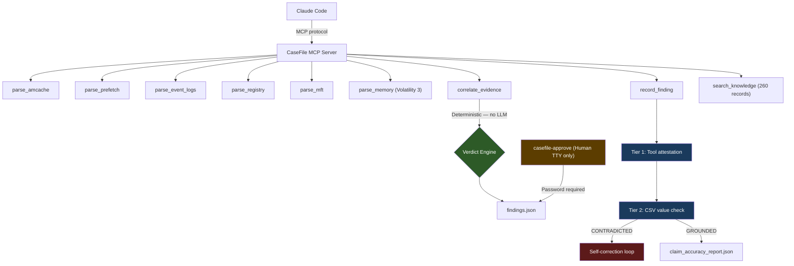

# CaseFile

[](https://github.com/nurusyda/casefile/actions/workflows/ci.yml)
[](https://github.com/nurusyda/casefile/blob/main/LICENSE)

**Autonomous forensic investigation for Claude Code on SIFT Workstation — 0.0% hallucination rate across all three tested datasets.**

CaseFile gives Claude Code structured access to Windows forensic artifact parsers, a
deterministic cross-source correlation engine, and a two-tier grounding verifier
that checks every claim against actual tool output — and self-corrects when verification
fails.

Built for the SANS Find Evil Hackathon 2026. Tested against the SRL-2018 CRIMSON OSPREY
case across three host types: workstation (BASE-RD-01), domain controller (BASE-DC),
and file server (BASE-FILE).

> **Important** — CaseFile is an autonomous investigation assistant, not a replacement
> for examiner judgment. The AI accelerates analysis; the examiner must review and
> approve every finding before it appears in any report.

---

## Results

Post-correction grounding verification across three datasets from the CRIMSON OSPREY case:

| Dataset | Host role | Findings | Claims | Grounded | Tier 2 verified | Hallucination | Self-corrections |
|---|---|---|---|---|---|---|---|
| SRL-2018 | Workstation (BASE-RD-01) | 5 | 10 | 10 (100%) | 7 | 0.0% | 1 |
| SRL-2018-DC | Domain Controller (BASE-DC) | 6 | 12 | 12 (100%) | 3 | 0.0% | 3 |
| SRL-2018-FILE | File Server (BASE-FILE) | 6 | 9 | 7 (77.8%) | 6 | 0.0% | 3 |

- **Grounded claim**: invocation ID found in audit log AND exact value found in parser CSV output
- **Tier 2 verified**: claim passed CSV cell-value verification (only applicable to tools that produce CSV output — Amcache, Registry, Event Logs, MFT, Hayabusa)
- **Hallucination rate**: `CONTRADICTED / total_claims`. A CONTRADICTED claim means the cited value was not found in tool output — the AI fabricated it.
- **Ungrounded claims** (SRL-2018-FILE only): audit field missing from audit entry — not a fabrication, but a traceability gap

Source files:
- `results/SRL-2018_workstation_session20.json`
- `results/SRL-2018-DC_session19.json`
- `results/SRL-2018-FILE_session01.json`

### vs. Protocol SIFT Baseline

To establish why architectural anti-hallucination matters, we ran Protocol SIFT on the
same SRL-2018 evidence and scored its output manually using CFA-Bench (6 investigation
checkpoints). Three of six answers contained fabricated details:

| Checkpoint | Question | Protocol SIFT | Failure mode |
|---|---|---|---|
| CP1 | Malware present on host? | ✅ Correct | — |
| CP2 | Execution evidence found? | ❌ Hallucinated | Execution time fabricated — not in artifact |
| CP3 | Persistence mechanism identified? | ❌ Hallucinated | Service name guessed, not parsed from registry |
| CP4 | Lateral movement confirmed? | ✅ Not detected | — |
| CP5 | Coherent UTC timeline produced? | ❌ Hallucinated | Timestamps not sourced from artifacts |
| CP6 | All findings traceable to artifacts? | ⚠️ No tracing | No invocation ID or tool citation produced |

**Protocol SIFT score: 2/6 correct, 3 hallucinated (50%)**

CaseFile addresses each failure mode architecturally: CP2/CP3 timestamps and service
names are parsed from CSV output and Tier 2 verified against the actual cell values.
CP5 timestamps carry invocation IDs linking to the parser run that produced them.
CP6 traceability is enforced by the audit chain (claim → invocation_id → audit/mcp.jsonl → CSV cell).

CaseFile's measured hallucination rate across 31 claims on three datasets: **0.0%** (0 contradicted).

Source: [`reports/protocol_sift_baseline.json`](reports/protocol_sift_baseline.json) (baseline established April 2026)

> **Note on SRL-2018-FILE grounding (77.8%):** Two claims are marked UNGROUNDED because
> the audit entry lacked a `csv_files` field — the Amcache and MFT parsers produced 0
> entries on this hive version, so ralph used pre-existing CSVs. The claims were not
> fabricated (0 CONTRADICTED); the gap is traceability, not accuracy. The framework
> flags this transparently rather than silently claiming full grounding.

---

## How It Works

### The Ralph Loop

`ralph.sh` runs Claude Code in an autonomous investigation loop (up to 25 iterations).
Each iteration: Claude reads the investigation tasks from `prd.json`, calls MCP forensic
tools, writes DRAFT findings with evidence quotes, and emits a `<promise>TASK_COMPLETE</promise>`
block when finished. On completion, `grounding_verify.py` checks every claim against
the audit log and parser CSVs. If any claim is CONTRADICTED, a targeted correction
prompt is built and sent back to Claude Code (max 3 correction attempts). The loop
exits when all claims are GROUNDED or the correction budget is exhausted.

### The Seven Laws

Claude Code operates under seven investigation laws (defined in `CLAUDE.md`):
evidence integrity (read-only), MCP-first tool routing (never raw shell), heartbeat
rule (OOM detection and recovery), epistemology (CONFIRMED/INFERRED/HYPOTHESIS
labeling), autonomous execution (no human-in-the-loop questions), completion promise
(structured output block), and tool call logging (every invocation recorded to
`audit/mcp.jsonl`).

### Tier 2 Verification

Beyond checking that an invocation ID exists in the audit log (Tier 1), CaseFile
opens the actual CSV output files produced by the parser and verifies that the
`exact_value` cited in each evidence quote appears as a literal cell value in the
data (Tier 2). This catches the "correct tool, wrong value" failure mode — e.g.,
citing a SHA1 hash that does not exist in the Amcache CSV. Tier 2 fires for all
tools that produce CSV output (Amcache, Registry, Event Logs, MFT, Hayabusa);
Prefetch and memory are Tier 1 only. See [docs/ARCHITECTURE.md](docs/ARCHITECTURE.md)
for the full design.

---

## Quickstart

### Prerequisites

| Dependency | Version | Notes |
|---|---|---|
| SIFT Workstation or Ubuntu | 22.04 | Works on SIFT or plain Ubuntu 22.04 |
| Python | 3.10+ | Pre-installed on Ubuntu 22.04 |
| EZ Tools | net9 builds | Installed by `setup-sift.sh` to `/opt/zimmermantools/` |
| Volatility 3 | latest | `pip install volatility3` |
| Hayabusa | v3.9.0+ | Binary at `/usr/local/bin/hayabusa`, rules at `/opt/hayabusa-rules` |
| Claude Code | latest | [claude.ai/code](https://claude.ai/code) |
| jq | any | `sudo apt-get install jq` |

### Install

```bash
git clone https://github.com/nurusyda/casefile.git
cd casefile

# Option A: Full SIFT setup (installs .NET 9, EZ Tools, Hayabusa, Python deps)
bash setup-sift.sh

# Option B: Python-only (if tools already installed)
pip install -e . --break-system-packages
```

### Run on a Sample Case

```bash
# Extract artifacts from E01 (~2 min)
bash scripts/ingest.sh /path/to/evidence.E01 CASE_NAME

# Set environment
export CASEFILE_CASE_ROOT=~/cases/CASE_NAME
export CASEFILE_CASE_DIR=~/cases/CASE_NAME
export CASEFILE_EXAMINER=your_name

# Run autonomous investigation
bash ralph.sh ~/cases/CASE_NAME

# Review and approve findings (requires TTY + password)
casefile-approve

# Generate report
python3 scripts/generate_html_report.py
```

Full setup instructions: [docs/DEPLOY.md](docs/DEPLOY.md).

---

## Architecture

CaseFile is an MCP (Model Context Protocol) server that wraps 21 MCP tools (13 forensic parsers plus correlation, findings, RAG, and accuracy workflow tools)
as typed, structured Python functions. Claude Code calls these tools over the MCP
protocol — it never sees raw shell output. Every tool call is logged to an
append-only audit trail. The grounding verifier runs post-investigation to check
every claim against tool output. The approve gate requires a human TTY and password —
the AI cannot approve its own findings.


```mermaid
graph TD
    A[Claude Code] -->|MCP protocol| B[CaseFile MCP Server]
    B --> C[parse_amcache]
    B --> D[parse_prefetch]
    B --> E[parse_event_logs]
    B --> F[parse_registry]
    B --> G[parse_mft]
    B --> H["parse_memory (Volatility 3)"]
    B --> I[correlate_evidence]
    B --> J[record_finding]
    B --> K["search_knowledge (260 records)"]
    I -->|"Deterministic — no LLM"| L{Verdict Engine}
    L --> M[findings.json]
    J --> N["Tier 1: Tool attestation"]
    N --> O["Tier 2: CSV value check"]
    O -->|CONTRADICTED| P["Self-correction loop"]
    O -->|GROUNDED| Q[claim_accuracy_report.json]
    R["casefile-approve (Human TTY only)"] -->|Password required| M
    style L fill:#2d5a27,color:#fff
    style N fill:#1a3a5c,color:#fff
    style O fill:#1a3a5c,color:#fff
    style P fill:#5c1a1a,color:#fff
    style R fill:#5c3d00,color:#fff
```

Full architecture: [docs/ARCHITECTURE.md](docs/ARCHITECTURE.md).

---

## Comparison to Valhuntir

CaseFile and [Valhuntir](https://github.com/forensicmike1/Valhuntir) are both
Find Evil Hackathon 2026 submissions that use LLMs for DFIR, but they take
fundamentally different approaches:

- **CaseFile** compresses the examiner loop: autonomous investigation with
  post-hoc grounding verification of every claim against actual tool output.
  Measured hallucination rate: 0.0% across three datasets. Strength is depth
  of verification, not breadth of tool coverage.
- **Valhuntir** provides breadth and human-in-the-loop discipline: 15 parsers,
  Hayabusa Sigma rules, OpenSearch indexing, RAG with 22,000+ records, multi-VM
  architecture, and a browser-based Examiner Portal. Strength is production
  readiness and comprehensive artifact coverage.

CaseFile has 21 MCP-registered tools vs. Valhuntir's broader tool suite. CaseFile
prioritizes anti-hallucination architecture; Valhuntir prioritizes workflow
completeness. They're different shapes of solution — not head-to-head competitors.

Detailed comparison: [docs/COMPARISON.md](docs/COMPARISON.md).

---

## Limitations

- **XP .evt files unsupported** — EvtxECmd only handles the .evtx format (Vista+).
  Windows XP Event Log files (.evt) cannot be parsed.
- **No OpenSearch indexing** — findings live in `findings.json` with no full-text
  search or dashboard integration. Cross-case correlation requires manual grep or jq.
- **Tier 2 coverage gap** — Prefetch (pyscca) and Memory (Volatility 3) do not
  produce CSV output in a format the verifier can read; these tools get Tier 1
  attestation only.
- **Single examiner only** — no multi-examiner export/merge workflow.
- **No case management UI** — all interaction is CLI + Claude Code terminal.
- **Live Amcache/MFT parsers may produce 0 entries** on some hive versions —
  the SRL-2018-FILE case relied on pre-existing CSVs from a prior session for
  those artifact types (documented gap in findings).
- **Not tested on a clean SIFT OVA from scratch** — `setup-sift.sh` has been
  validated incrementally.

---

## Roadmap

- [ ] OpenSearch indexing for cross-case finding search and dashboards
- [ ] XP .evt support via a separate parser path
- [ ] Tier 2 CSV coverage for Prefetch and Memory (bridge the format gap)
- [ ] Multi-examiner merge workflow
- [ ] Browser-based review portal
- [ ] Plaso/log2timeline integration for supertimeline generation
- [ ] Velociraptor artifact collection integration

---

## MCP Tools (21 registered)

| Tool | Backend | Description |
|---|---|---|
| `parse_amcache()` | AmcacheParser.dll | SHA1 hashes, execution history |
| `parse_prefetch()` | pyscca (libscca) | Execution counts, last run times |
| `parse_event_logs()` | EvtxECmd.dll | EVTX parsing with IOC matching |
| `parse_registry()` | RECmd.dll | Hive parsing — Run keys, services, USB |
| `parse_mft()` | MFTECmd.dll | MFT timestamps, timestomping detection |
| `parse_memory()` | Volatility 3 | pslist, psscan, netscan, cmdline, malfind |
| `parse_shellbags()` | SBECmd.dll | Folder access history |
| `parse_hayabusa()` | Hayabusa | Sigma rule detection (3,700+ rules) |
| `parse_lnk()` | LECmd.dll | Shortcut file analysis |
| `parse_jumplists()` | JLECmd.dll | Jump List analysis |
| `parse_volatility_pslist()` | Volatility 3 | Dedicated process listing |
| `parse_volatility_netscan()` | Volatility 3 | Dedicated network connections |
| `correlate_evidence()` | Deterministic engine | 4-source cross-correlation verdict |
| `detect_host_type()` | Artifact layout | Host classification (workstation/DC/memory-only) |
| `record_finding()` | — | Stage finding with evidence quotes |
| `get_findings()` | — | Retrieve findings with status filter |
| `record_timeline_event()` | — | Add event to investigation timeline |
| `export_findings()` | — | ECS/OCSF-compatible export |
| `generate_accuracy_report()` | — | CFA-Bench checkpoint scoring |
| `search_knowledge()` | TF-IDF | Forensic RAG — 260 curated records |
| `get_knowledge_stats()` | — | RAG index statistics |

---

## Tests

```bash
pytest tests/ -q
# 626 passed
```

---

## Project Structure

```
casefile/
├── mcp_server/
│   ├── server.py                # FastMCP server — 21 tools registered
│   └── tools/
│       ├── amcache.py           parse_amcache()
│       ├── prefetch.py          parse_prefetch()
│       ├── event_logs.py        parse_event_logs()
│       ├── registry.py          parse_registry()
│       ├── mft.py               parse_mft()
│       ├── memory.py            parse_memory() — Volatility 3
│       ├── shellbags.py         parse_shellbags()
│       ├── hayabusa.py          parse_hayabusa()
│       ├── lnk.py               parse_lnk()
│       ├── jumplists.py         parse_jumplists()
│       ├── vol_pslist.py        parse_volatility_pslist()
│       ├── vol_netscan.py       parse_volatility_netscan()
│       ├── correlation.py       correlate_evidence() + detect_host_type()
│       ├── findings.py          record_finding(), get_findings(), record_timeline_event()
│       ├── grounding.py         Tier 1/2 verification
│       ├── forensic_rag.py      search_knowledge(), get_knowledge_stats()
│       ├── accuracy.py          generate_accuracy_report()
│       └── export_findings.py   export_findings()
├── scripts/
│   ├── ingest.sh                E01 → parsed artifacts
│   ├── grounding_verify.py      Post-run grounding check
│   ├── grounding_recheck.py     Correction loop re-check
│   ├── grounding_correction_prompt.py  Correction prompt builder
│   └── generate_html_report.py  Dark-theme HTML report
├── ralph.sh                     Autonomous investigation loop
├── setup-sift.sh                One-shot dependency installer
├── CLAUDE.md                    Investigation laws for Claude Code
├── docs/
│   ├── ARCHITECTURE.md
│   ├── DEPLOY.md
│   ├── CASE_WALKTHROUGH.md
│   └── COMPARISON.md
├── tests/                       626 tests
└── LICENSE                      MIT
```

---

## License

MIT. See [LICENSE](LICENSE).

---

## Acknowledgments

Built for the SANS Find Evil Hackathon 2026.

MITRE ATT&CK® is a registered trademark of The MITRE Corporation.
SIFT Workstation is a product of the SANS Institute.
