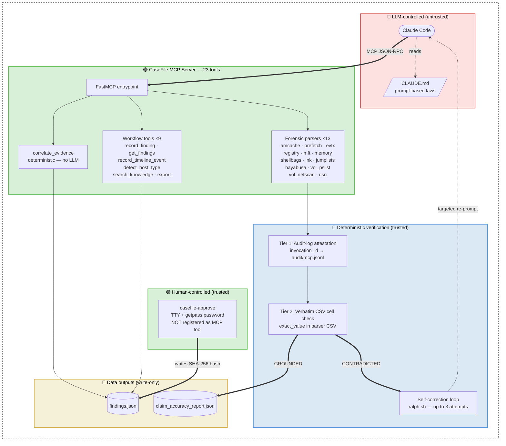

# CaseFile

[](https://github.com/nurusyda/casefile/actions/workflows/ci.yml)
[](https://github.com/nurusyda/casefile/blob/main/LICENSE)

**Autonomous forensic investigation for Claude Code on SIFT Workstation — 0.0% hallucination rate across all four tested datasets.**

CaseFile gives Claude Code structured access to Windows forensic artifact parsers, a
deterministic cross-source correlation engine, and a two-tier grounding verifier
that checks every claim against actual tool output — and self-corrects when verification
fails.

Built for the SANS Find Evil Hackathon 2026. Tested against the SRL-2018 CRIMSON OSPREY
case across four host types: workstation (BASE-RD-01), domain controller (BASE-DC),
file server (BASE-FILE), and workstation re-run on a live SIFT OVA (SRL-2018-WKSTN).

> **Important** — CaseFile is an autonomous investigation assistant, not a replacement
> for examiner judgment. The AI accelerates analysis; the examiner must review and
> approve every finding before it appears in any report.

---

## Verified Properties

Three properties of this submission can be reproduced by a judge from a fresh clone in
under five minutes — every claim below has a committed artifact and a one-command check.

- **0.0% hallucination, judge-reproducible.** `bash verify.sh` re-runs grounding
  verification against committed sanitized fixtures (audit logs + trimmed parser CSVs)
  and reprints the headline numbers per case and in aggregate. All four datasets
  reproduce full Tier 1 + Tier 2 attestation. No raw evidence required.
  *Artifact:* [`verify.sh`](verify.sh), [`fixtures/reproducibility/`](fixtures/reproducibility).
- **0.0% false-positive rate on a benign control corpus.** A 25-row synthetic
  clean-Windows corpus is passed through all five parsers; zero rows are flagged as
  suspicious. `csrss.exe` at `C:\Windows\System32` is **not** flagged while `csrss.exe`
  at `Temp\Perfmon` **is** — path-sensitive matching, not name-blind keyword hits.
  *Artifact:* [`tests/test_false_positive.py`](tests/test_false_positive.py)
  (44 tests), [`tests/fixtures/clean/`](tests/fixtures/clean).
- **Evidence-borne prompt injection is contained at the architecture layer.**
  Adversarial instructions embedded in evidence (filenames, registry values,
  event-log fields, finding text) cannot escalate the agent's privileges, because
  destructive and approval capabilities are not registered as MCP tools. Injection
  can bias reasoning; it cannot reach action. The reasoning channel is caught
  downstream by the grounding verifier, not by this boundary.
  *Artifact:* BYPASS-9 in [`docs/SECURITY_MODEL.md`](docs/SECURITY_MODEL.md),
  6 tests in [`tests/test_security_boundaries.py`](tests/test_security_boundaries.py).

---

## Development Honesty — what the verifier caught during build

The grounding verifier caught real failures during development, not just synthetic
ones. Two examples, both committed to git history:

- **Tool-name aliasing**: Early DC and WKSTN runs flagged claims as CONTRADICTED
  because Claude recorded the short tool name (`detect_host_type`) while the audit
  log entry recorded the MCP-prefixed name (`mcp__casefile__detect_host_type`). The
  verifier was doing exact-string matching. Fix: prefix-aware alias map in
  `mcp_server/tools/grounding.py` (commit `891956b`). The self-correction loop
  failed across 3 iterations on these runs — the architecture honestly refused to
  certify and printed `Human review required`. After the fix landed, the same cases
  re-ran clean in one self-correction iteration.

- **Volatility3 sub-plugin names**: A related variant where
  `Volatility3-windows.pslist` was treated as different from `Volatility3`. Same
  fix pattern, same file (commit `92a447f`).

Both issues are in the audit logs of the failed and clean runs
(`results/SRL-2018-DC_session19.json`, `results/SRL-2018_workstation_session20.json`,
etc.). The architecture worked exactly as designed: it refused to silently accept
findings it couldn't verify, forced human investigation, and the fix went into code
rather than into a special case for this demo.

This isn't a demo where everything happened to work on the first try — this is a
demo where the loop failed, the failure was real, the fix is in commit history, and
the system is now stable on those classes of failure.

---

## Results

Post-correction grounding verification across four datasets from the CRIMSON OSPREY case:

Evidence types covered. Three disk + memory pairs (workstation BASE-RD-01, domain controller BASE-DC, file server BASE-FILE) plus one memory-only investigation (base-wkstn-01, on a clean SIFT OVA). All four cases were sourced from the same SRL-2018 CRIMSON OSPREY intrusion. The memory-only case demonstrates that CaseFile's grounding architecture works for live-acquisition forensics — not just disk artifacts — including transparent traceability gaps when Volatility3's symbol resolution fails on a specific Windows build.

| Dataset | Host role | Findings | Claims | Grounded | Tier 2 verified | Hallucination | Self-corrections |
|---|---|---|---|---|---|---|---|
| SRL-2018 | Workstation (BASE-RD-01) | 5 | 10 | 10 (100%) | 7 | 0.0% | 1 |
| SRL-2018-DC | Domain Controller (BASE-DC) | 6 | 12 | 12 (100%) | 3 | 0.0% | 3 |
| SRL-2018-FILE | File Server (BASE-FILE) | 6 | 9 | 7 (77.8%) | 6 | 0.0% | 3 |
| SRL-2018-WKSTN | Workstation memory only (`base-wkstn-01`) | 8 | 10 | 6 (60.0%) | 3 | 0.0% | 0 |

- **Grounded claim**: invocation ID found in audit log AND exact value found in parser CSV output
- **Tier 2 verified**: claim passed CSV cell-value verification (only applicable to tools that produce CSV output — Amcache, Registry, Event Logs, MFT, Hayabusa)
- **Hallucination rate**: `CONTRADICTED / total_claims`. A CONTRADICTED claim means the cited value was not found in tool output — the AI fabricated it.
- **Ungrounded claims** (SRL-2018-FILE: 2 claims, SRL-2018-WKSTN: 4 claims): audit field missing from audit entry — not a fabrication, but a traceability gap
- **False-positive rate on a benign control corpus: 0.0%** (0 of 25 synthetic benign rows flagged across all five parsers; `tests/test_false_positive.py`)

Source files:
- `results/SRL-2018_workstation_session20.json`
- `results/SRL-2018-DC_session19.json`
- `results/SRL-2018-FILE_session01.json`
- `results/SRL-2018-WKSTN_audit_sample.jsonl`

### Evidence & Verification Index

Everything a judge or reader might want to verify, linked in one place.

#### Verify the accuracy numbers

| Artifact | What it is |
|---|---|
| [`bash verify.sh`](verify.sh) | Re-runs the grounding verifier against all four committed fixtures. Exit 0 = our numbers reproduce. Under a minute, no evidence required. |
| [`docs/manual_verification.md`](docs/manual_verification.md) | Walks one finding by hand in three shell commands — for readers who want to check the verifier itself. |

#### Per-case findings (what the agent actually wrote)

| Case | Findings (human-readable) | Findings (machine-readable) | Grounding report |
|---|---|---|---|
| Workstation (BASE-RD-01) | [`reports/CRIMSON_OSPREY_findings.md`](reports/CRIMSON_OSPREY_findings.md) | [`results/SRL-2018_workstation_findings.json`](results/SRL-2018_workstation_findings.json) | [`results/SRL-2018_workstation_session20.json`](results/SRL-2018_workstation_session20.json) |
| Domain Controller (BASE-DC) | [`reports/CRIMSON_OSPREY_DC_session19.md`](reports/CRIMSON_OSPREY_DC_session19.md) | [`results/SRL-2018-DC_findings.json`](results/SRL-2018-DC_findings.json) | [`results/SRL-2018-DC_session19.json`](results/SRL-2018-DC_session19.json) |
| File Server (BASE-FILE) | findings in [`results/SRL-2018-FILE_findings.json`](results/SRL-2018-FILE_findings.json) | same | [`results/SRL-2018-FILE_session01.json`](results/SRL-2018-FILE_session01.json) |
| base-wkstn-01 (memory only) | findings in [`fixtures/reproducibility/SRL-2018-WKSTN/findings.json`](fixtures/reproducibility/SRL-2018-WKSTN/findings.json) | same | [`results/SRL-2018-WKSTN_audit_sample.jsonl`](results/SRL-2018-WKSTN_audit_sample.jsonl) |

#### Synthesis & methodology

| Document | What it covers |
|---|---|
| [`docs/accuracy_report.md`](docs/accuracy_report.md) | Per-checkpoint CFA-Bench scoring, false-positive analysis, grounding verification methodology. |
| [`docs/SECURITY_MODEL.md`](docs/SECURITY_MODEL.md) | BYPASS-1 through BYPASS-9 matrix — architectural vs prompt-based guardrails, file-and-line references. |
| [`docs/dataset.md`](docs/dataset.md) | Evidence provenance, SHA-256 hashes at ingest, per-host artifact coverage. |
| [`docs/ARCHITECTURE.md`](docs/ARCHITECTURE.md) | Full system diagram, claim → audit → CSV trace example. |

### Reproduce our numbers

```bash
bash verify.sh
```

Re-runs grounding verification against committed sanitized fixtures — **no raw evidence
required**. The script copies each fixture into a temp directory, expands path tokens,
runs the same `scripts/grounding_verify.py` that ralph.sh uses, and diffs the resulting
claim-accuracy report against the committed expected values. Exit 0 only if every case
reproduces its committed `total_claims`, `grounded`, `contradicted`, `hallucination_rate`,
and `tier2_verified`.

- **All four cases** reproduce full Tier 1 + Tier 2 attestation — minimal parser CSVs
  are committed alongside the sanitized audit log for every case, so exact-value CSV
  checks reproduce across the board.

  Or walk a single finding by hand: [docs/manual_verification.md](docs/manual_verification.md). It's the artifact equivalent of showing your work on a math test — the answer was already correct, but seeing one example computed by hand makes the whole sheet land harder.

### Architectural enforcement vs prompt-based restriction

**Architectural enforcement vs prompt-based restriction.** The defining design
choice in CaseFile is that every protective guarantee is enforced in code, not in
the agent's prompt. The agent cannot fabricate an approved finding because the
approve capability is not registered as an MCP tool. The agent cannot modify
evidence because the MCP server only exposes read paths into the evidence
directory. The agent cannot bypass the grounding verifier because the verifier
runs as a separate, deterministic post-investigation step that exits non-zero on
any contradicted claim.

CaseFile's measured hallucination rate across 41 claims on four datasets: **0.0%** (0 contradicted).

> **Note on SRL-2018-FILE grounding (77.8%):** Two claims are marked UNGROUNDED because
> the audit entry lacked a `csv_files` field — the Amcache and MFT parsers produced 0
> entries on this hive version, so ralph used pre-existing CSVs. The claims were not
> fabricated (0 CONTRADICTED); the gap is traceability, not accuracy. The framework
> flags this transparently rather than silently claiming full grounding.

---

## How It Works

### The Ralph Loop

`ralph.sh` runs Claude Code in an autonomous investigation loop (up to 25 iterations).
Each iteration: Claude reads the investigation tasks from `prd.json`, calls MCP forensic
tools, writes DRAFT findings with evidence quotes, and emits a `<promise>TASK_COMPLETE</promise>`
block when finished. On completion, `grounding_verify.py` checks every claim against
the audit log and parser CSVs. If any claim is CONTRADICTED, a targeted correction
prompt is built and sent back to Claude Code (max 3 correction attempts). The loop
exits when all claims are GROUNDED or the correction budget is exhausted.

### The Seven Laws

Claude Code operates under seven investigation laws (defined in `CLAUDE.md`):
evidence integrity (read-only), MCP-first tool routing (never raw shell), heartbeat
rule (OOM detection and recovery), epistemology (CONFIRMED/INFERRED/HYPOTHESIS
labeling), autonomous execution (no human-in-the-loop questions), completion promise
(structured output block), and tool call logging (every invocation recorded to
`audit/mcp.jsonl`).

### Tier 2 Verification

Beyond checking that an invocation ID exists in the audit log (Tier 1), CaseFile
opens the actual CSV output files produced by the parser and verifies that the
`exact_value` cited in each evidence quote appears as a literal cell value in the
data (Tier 2). This catches the "correct tool, wrong value" failure mode — e.g.,
citing a SHA1 hash that does not exist in the Amcache CSV. Tier 2 fires for all
tools that produce CSV output (Amcache, Registry, Event Logs, MFT, Hayabusa);
Prefetch and memory are Tier 1 only. See [docs/ARCHITECTURE.md](docs/ARCHITECTURE.md)
for the full design.

---

## Quickstart

### Prerequisites

| Dependency | Version | Notes |
|---|---|---|
| SIFT Workstation or Ubuntu | 22.04 | Works on SIFT or plain Ubuntu 22.04 |
| Python | 3.10+ | Pre-installed on Ubuntu 22.04 |
| EZ Tools | net9 builds | Installed by `setup-sift.sh` to `/opt/zimmermantools/` |
| Volatility 3 | latest | `pip install volatility3` |
| Hayabusa | v3.9.0+ | Binary at `/usr/local/bin/hayabusa`, rules at `/opt/hayabusa-rules` |
| Claude Code | latest | [claude.ai/code](https://claude.ai/code) |
| jq | any | `sudo apt-get install jq` |

### Install

```bash
git clone https://github.com/nurusyda/casefile.git
cd casefile

# Option A: Full SIFT setup (installs .NET 9, EZ Tools, Hayabusa, Python deps)
bash setup-sift.sh

# Option B: Python-only (if tools already installed)
pip install -e . --break-system-packages
```

### Run on a Sample Case

```bash
# Extract artifacts from E01 (~2 min)
bash scripts/ingest.sh /path/to/evidence.E01 CASE_NAME

# Set environment
export CASEFILE_CASE_ROOT=~/cases/CASE_NAME
export CASEFILE_CASE_DIR=~/cases/CASE_NAME
export CASEFILE_EXAMINER=your_name

# Run autonomous investigation
bash ralph.sh ~/cases/CASE_NAME

# Review and approve findings (requires TTY + password)
casefile-approve

# Generate report
python3 scripts/generate_html_report.py
```

Full setup instructions: [docs/DEPLOY.md](docs/DEPLOY.md).

---

## Architecture

**Architectural pattern: Approach 2 — Custom MCP Server** (per the *Find Evil!* 2026
hackathon brief's four supported approaches). CaseFile is a parallel MCP server. The choice was deliberate: a typed tool surface
lets us enforce architectural anti-hallucination guarantees (registered-tool gating,
read-only evidence paths, TTY-only approval) that a prompt-layer extension cannot
provide.

CaseFile wraps 23 MCP tools (13 forensic parsers plus correlation, findings, RAG,
and accuracy workflow tools) as typed, structured Python functions. Claude Code
calls these tools over the MCP protocol — it never sees raw shell output. Every
tool call is logged to an append-only audit trail. The grounding verifier runs
post-investigation to check every claim against tool output. The approve gate
requires a human TTY and password — the AI cannot approve its own findings.


```mermaid
%%{init: {'theme':'default', 'themeVariables': {'fontFamily':'system-ui'}}}%%
flowchart TB

    subgraph PATTERN[" "]
        direction TB

        subgraph LLM["🔴 LLM-controlled (untrusted)"]
            A([Claude Code])
            CL[/"CLAUDE.md<br/>prompt-based laws"/]
        end

        subgraph MCPS["🟢 CaseFile MCP Server — 23 tools"]
            direction TB
            B[FastMCP entrypoint]
            FP["Forensic parsers ×13<br/>amcache · prefetch · evtx<br/>registry · mft · memory<br/>shellbags · lnk · jumplists<br/>hayabusa · vol_pslist<br/>vol_netscan · usn"]
            CE["correlate_evidence<br/>deterministic — no LLM"]
            FW["Workflow tools ×9<br/>record_finding · get_findings<br/>record_timeline_event<br/>detect_host_type<br/>search_knowledge · export"]
        end

        subgraph VERIF["🔵 Deterministic verification (trusted)"]
            direction TB
            T1["Tier 1: Audit-log attestation<br/>invocation_id → audit/mcp.jsonl"]
            T2["Tier 2: Verbatim CSV cell check<br/>exact_value in parser CSV"]
            SC["Self-correction loop<br/>ralph.sh — up to 3 attempts"]
        end

        subgraph HUMAN["🟢 Human-controlled (trusted)"]
            AP["casefile-approve<br/>TTY + getpass password<br/>NOT registered as MCP tool"]
        end

        subgraph DATA["📁 Data outputs (write-only)"]
            direction LR
            FJ[(findings.json)]
            AR[(claim_accuracy_report.json)]
        end

    end

    A == "MCP JSON-RPC" ==> B
    A -. reads .-> CL
    B --> FP
    B --> CE
    B --> FW
    CE --> FJ
    FW --> FJ
    FP --> T1
    T1 --> T2
    T2 == GROUNDED ==> AR
    T2 == CONTRADICTED ==> SC
    SC -. "targeted re-prompt" .-> A
    AP == "writes SHA-256 hash" ==> FJ

    classDef untrustedZone fill:#fde0e0,stroke:#d94a4a,stroke-width:2px,color:#000
    classDef archZone fill:#d8efd8,stroke:#5fbf52,stroke-width:2px,color:#000
    classDef determZone fill:#dbe9f5,stroke:#4a90d9,stroke-width:2px,color:#000
    classDef dataZone fill:#f5f0d8,stroke:#d4a73a,stroke-width:2px,color:#000
    classDef outerZone fill:transparent,stroke:#666,stroke-width:1.5px,color:#222,stroke-dasharray:4 4

    class LLM untrustedZone
    class MCPS,HUMAN archZone
    class VERIF determZone
    class DATA dataZone
    class PATTERN outerZone
```

> 🟢 **Green** = architectural guardrails (enforced in code, cannot be bypassed by the LLM) · 🟠 **Orange dashed** = prompt-based laws (CLAUDE.md) · 🔵 **Blue** = deterministic verification (no LLM in the decision path) · 🔴 **Red** = LLM-controlled / untrusted

Full architecture: [docs/ARCHITECTURE.md](docs/ARCHITECTURE.md).

---

## Comparison to Valhuntir

CaseFile and [Valhuntir](https://github.com/forensicmike1/Valhuntir) are both
Find Evil Hackathon 2026 submissions that use LLMs for DFIR, but they take
fundamentally different approaches:

- **CaseFile** compresses the examiner loop: autonomous investigation with
  post-hoc grounding verification of every claim against actual tool output.
  Measured hallucination rate: 0.0% across four datasets. Strength is depth
  of verification, not breadth of tool coverage.
- **Valhuntir** provides breadth and human-in-the-loop discipline: 15 parsers,
  Hayabusa Sigma rules, OpenSearch indexing, RAG with 22,000+ records, multi-VM
  architecture, and a browser-based Examiner Portal. Strength is production
  readiness and comprehensive artifact coverage.

CaseFile has 23 MCP-registered tools vs. Valhuntir's broader tool suite. CaseFile
prioritizes anti-hallucination architecture; Valhuntir prioritizes workflow
completeness. They're different shapes of solution — not head-to-head competitors.

Detailed comparison: [docs/COMPARISON.md](docs/COMPARISON.md).

---

## Limitations

- **XP .evt files unsupported** — EvtxECmd only handles the .evtx format (Vista+).
  Windows XP Event Log files (.evt) cannot be parsed.
- **No OpenSearch indexing** — findings live in `findings.json` with no full-text
  search or dashboard integration. Cross-case correlation requires manual grep or jq.
- **Tier 2 coverage gap** — Prefetch (pyscca) and Memory (Volatility 3) do not
  produce CSV output in a format the verifier can read; these tools get Tier 1
  attestation only.
- **Single examiner only** — no multi-examiner export/merge workflow.
- **No case management UI** — all interaction is CLI + Claude Code terminal.
- **Live Amcache/MFT parsers may produce 0 entries** on some hive versions —
  the SRL-2018-FILE case relied on pre-existing CSVs from a prior session for
  those artifact types (documented gap in findings).
- **Not tested on a clean SIFT OVA from scratch** — `setup-sift.sh` has been
  validated incrementally.

---

## Roadmap

- [ ] OpenSearch indexing for cross-case finding search and dashboards
- [ ] XP .evt support via a separate parser path
- [ ] Tier 2 CSV coverage for Prefetch and Memory (bridge the format gap)
- [ ] Multi-examiner merge workflow
- [ ] Browser-based review portal
- [ ] Plaso/log2timeline integration for supertimeline generation
- [ ] Velociraptor artifact collection integration

---

## MCP Tools (23 registered)

| Tool | Backend | Description |
|---|---|---|
| `parse_amcache()` | AmcacheParser.dll | SHA1 hashes, execution history |
| `parse_prefetch()` | pyscca (libscca) | Execution counts, last run times |
| `parse_event_logs()` | EvtxECmd.dll | EVTX parsing with IOC matching |
| `parse_registry()` | RECmd.dll | Hive parsing — Run keys, services, USB |
| `parse_mft()` | MFTECmd.dll | MFT timestamps, timestomping detection |
| `parse_memory()` | Volatility 3 | pslist, psscan, netscan, cmdline, malfind |
| `parse_shellbags()` | SBECmd.dll | Folder access history |
| `parse_hayabusa()` | Hayabusa | Sigma rule detection (3,700+ rules) |
| `parse_lnk()` | LECmd.dll | Shortcut file analysis |
| `parse_jumplists()` | JLECmd.dll | Jump List analysis |
| `parse_usn_journal()` | MFTECmd.dll ($J mode) | NTFS USN Change Journal — file change/delete history |
| `parse_volatility_pslist()` | Volatility 3 | Dedicated process listing |
| `parse_volatility_netscan()` | Volatility 3 | Dedicated network connections |
| `correlate_evidence()` | Deterministic engine | 4-source cross-correlation verdict |
| `check_timeline_contradictions()` | Deterministic engine | Cross-source timeline anomaly detection (T1–T6) |
| `detect_host_type()` | Artifact layout | Host classification (workstation/DC/memory-only) |
| `record_finding()` | — | Stage finding with evidence quotes |
| `get_findings()` | — | Retrieve findings with status filter |
| `record_timeline_event()` | — | Add event to investigation timeline |
| `export_findings()` | — | ECS/OCSF-compatible export |
| `generate_accuracy_report()` | — | CFA-Bench checkpoint scoring |
| `search_knowledge()` | TF-IDF | Forensic RAG — 260 curated records |
| `get_knowledge_stats()` | — | RAG index statistics |

---

## Tests

```bash
pytest tests/ -q
# 672 passed
```

---

## Project Structure

```
casefile/
├── mcp_server/
│   ├── server.py                # FastMCP server — 23 tools registered
│   └── tools/
│       ├── amcache.py           parse_amcache()
│       ├── prefetch.py          parse_prefetch()
│       ├── event_logs.py        parse_event_logs()
│       ├── registry.py          parse_registry()
│       ├── mft.py               parse_mft()
│       ├── memory.py            parse_memory() — Volatility 3
│       ├── shellbags.py         parse_shellbags()
│       ├── hayabusa.py          parse_hayabusa()
│       ├── lnk.py               parse_lnk()
│       ├── jumplists.py         parse_jumplists()
│       ├── usn.py               parse_usn_journal()
│       ├── vol_pslist.py        parse_volatility_pslist()
│       ├── vol_netscan.py       parse_volatility_netscan()
│       ├── timeline_check.py    check_timeline_contradictions()
│       ├── correlation.py       correlate_evidence() + detect_host_type()
│       ├── findings.py          record_finding(), get_findings(), record_timeline_event()
│       ├── grounding.py         Tier 1/2 verification
│       ├── forensic_rag.py      search_knowledge(), get_knowledge_stats()
│       ├── accuracy.py          generate_accuracy_report()
│       └── export_findings.py   export_findings()
├── scripts/
│   ├── ingest.sh                E01 → parsed artifacts
│   ├── grounding_verify.py      Post-run grounding check
│   ├── grounding_recheck.py     Correction loop re-check
│   ├── grounding_correction_prompt.py  Correction prompt builder
│   └── generate_html_report.py  Dark-theme HTML report
├── ralph.sh                     Autonomous investigation loop
├── setup-sift.sh                One-shot dependency installer
├── CLAUDE.md                    Investigation laws for Claude Code
├── docs/
│   ├── ARCHITECTURE.md
│   ├── DEPLOY.md
│   ├── CASE_WALKTHROUGH.md
│   └── COMPARISON.md
├── tests/                       672 tests
└── LICENSE                      MIT
```

---

## License

MIT. See [LICENSE](LICENSE).

---

## Acknowledgments

Built for the SANS Find Evil Hackathon 2026.

MITRE ATT&CK® is a registered trademark of The MITRE Corporation.
SIFT Workstation is a product of the SANS Institute.
