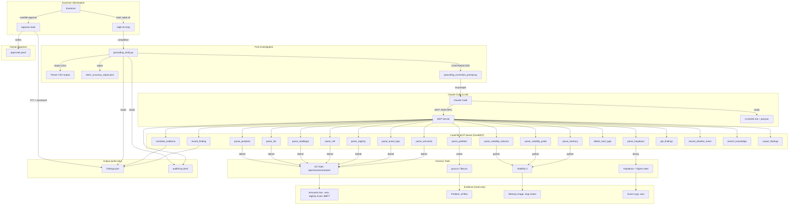
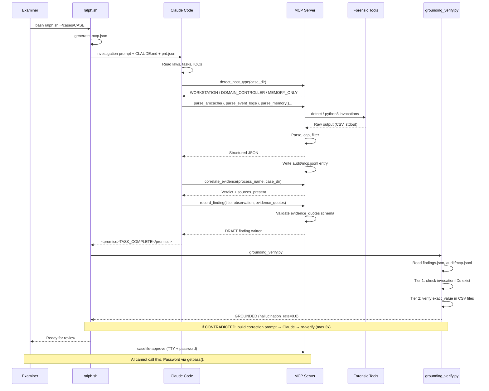

# Architecture

How CaseFile turns Claude Code from a chatbot into a grounded forensic investigator.

**Architectural pattern: Approach 2 — Custom MCP Server** (per the *Find Evil!* 2026
hackathon brief's four supported approaches). CaseFile runs as a parallel MCP server
beside Claude Code, not as an extension of Protocol SIFT. The trade-off this choice
makes explicit: we accept the cost of duplicating some Protocol SIFT capabilities in
order to enforce architectural guarantees — registered-tool gating, read-only
evidence paths, TTY-only approval, and a typed tool surface that a prompt-layer
extension to Protocol SIFT could not provide.

---

## System Overview



---

## The Seven Laws

These are the investigation rules from `CLAUDE.md` that govern Claude Code's behavior.
They are enforced through a combination of architectural constraints (the MCP server
validates inputs in code) and prompt-based constraints (Claude Code reads CLAUDE.md
at the start of every investigation).

### Law 1 — Evidence Integrity

```
NEVER modify, delete, overwrite, or touch any file in:
  /cases/ /mnt/ /media/ /evidence/ *.E01 *.img *.vmem
```

Enforced architecturally: the MCP server validates all input paths against
`CASEFILE_CASE_ROOT` and rejects symlinks to prevent traversal. Settings.json
deny rules provide defense-in-depth. All tool output goes to `./analysis/`,
`./reports/`, or `./audit/`.

### Law 2 — MCP First (Never Raw Shell)

Claude Code calls MCP functions for all forensic analysis. It never runs raw
`dotnet` or `vol.py` shell commands. The MCP server parses all tool output
server-side before returning structured JSON — the LLM never sees raw 300K+ line
tool output. This is the primary anti-hallucination mechanism.

### Law 3 — Heartbeat Rule

If any MCP call produces no output after 30 seconds, Claude must stop, check RAM
(`free -h`), and retry with reduced scope. Never run Volatility and EZ Tools
simultaneously on an 8 GB machine. Recovery actions are logged to `./analysis/heartbeat.log`.

### Law 4 — Epistemology (CONFIRMED/INFERRED)

Every finding must carry one of two labels:
- **CONFIRMED**: directly proven by artifact (tool name + file path + specific field)
- **INFERRED**: probable based on artifact pattern + forensic methodology

CONFIRMED requires a `correlate_evidence()` verdict of `CONFIRMED_RUNNING`,
`CONFIRMED_HISTORICAL`, or `MEMORY_ONLY`. Without that verdict, the finding
defaults to INFERRED.

### Law 5 — Autonomous Execution

No questions during investigation. If something is ambiguous, make the safer
assumption, document it, and proceed. If a tool fails, apply the Heartbeat Rule
and retry.

### Law 6 — Completion Promise

Every investigation must end with a structured `<promise>` block containing
counts of confirmed, inferred, and self-correction findings.

### Law 7 — Tool Call Logging

Every MCP function call is automatically logged to `audit/mcp.jsonl` with
invocation ID, tool name, timestamps, return codes, and output metadata.
Claude Code references these invocation IDs in evidence quotes.

---

## The Ralph Loop



### Iteration flow

1. **ralph.sh** generates `.mcp.json` with the current case directory and examiner
2. Builds investigation prompt: read CLAUDE.md + prd.json + IOCs
3. Pipes prompt to `claude -p --mcp-config .mcp.json`
4. Claude runs investigation autonomously — calls MCP tools, records findings
5. Claude emits `<promise>TASK_COMPLETE</promise>` block
6. **ralph.sh** extracts the promise, scores checkpoints, runs `grounding_verify.py`
7. If GROUNDED (exit 0): done
8. If CONTRADICTED (exit 2): `grounding_correction_prompt.py` builds correction prompt,
   sends back to Claude Code, re-runs `grounding_recheck.py` (max 3 iterations)
9. If import error (exit 1): halt with error

### Environment variables

| Variable | Required | Purpose |
|---|---|---|
| `CASEFILE_CASE_ROOT` | Yes | Base path for tool path validation |
| `CASEFILE_CASE_DIR` | Yes | Active case directory |
| `CASEFILE_EXAMINER` | Recommended | Embedded in finding IDs and audit records |

---

## Tier 1 vs Tier 2 Grounding

### Tier 1 — Invocation Attestation

For every evidence quote, the verifier checks that the `invocation_id` exists in
`audit/mcp.jsonl` and that the `tool` field matches the audit entry's tool name.
A tool name alias map resolves logical names (`parse_prefetch`) to canonical
audit names (`pyscca`).

**What it catches**: fabricated tool calls — the AI claiming evidence from a
tool it never actually invoked.

### Tier 2 — CSV Value Verification

For evidence quotes that include `exact_value`, the verifier opens the actual
CSV output files referenced in the audit entry's `csv_files` field and searches
for the cited value as a literal cell in the data. The match is case-insensitive
exact field match — not substring, not fuzzy.

**What it catches**: correct tool called, wrong value cited — e.g., claiming a
SHA1 hash that does not appear in the Amcache CSV, or citing a service name that
was not in the Event Log output.

### Coverage

| Tool | CSV output? | Tier 1 | Tier 2 |
|---|---|---|---|
| AmcacheParser | Yes | ✓ | ✓ |
| EvtxECmd | Yes | ✓ | ✓ |
| RECmd | Yes | ✓ | ✓ |
| MFTECmd | Yes | ✓ | ✓ |
| Hayabusa | Yes | ✓ | ✓ |
| pyscca (Prefetch) | No standard CSV | ✓ | — |
| Volatility 3 (Memory) | No standard CSV | ✓ | — |
| correlate_evidence | No CSV | ✓ | — |

Tier 2 covers 5 of 8 parser tools. The two largest gaps are Prefetch and Memory —
both produce output formats the verifier cannot currently parse as CSV.

---

## Audit Chain

Every claim traces back through three artifacts:

```
claim_text → invocation_id → audit/mcp.jsonl entry → CSV cell
```

### Example trace

1. **Claim** (in evidence_quote):
   ```
   "tool": "EvtxECmd",
   "invocation_id": "33c87d3b-75db-486c-b9c4-09567dcc2003",
   "claim": "Service F-Response Subject installed with subject_srv.exe auto-start",
   "exact_value": "Name: F-Response Subject"
   ```

2. **Audit log entry** (`audit/mcp.jsonl`):
   ```json
   {
     "invocation_id": "33c87d3b-75db-486c-b9c4-09567dcc2003",
     "tool": "EvtxECmd",
     "ts": "2026-06-06T13:49:57.123456+00:00",
     "parsed_record_count": 239,
     "csv_files": ["/home/sansproject/cases/SRL-2018-FILE/analysis/evtx_out/..."]
   }
   ```

3. **CSV cell** (in `evtx_out/...csv`):
   ```
   Name: F-Response Subject
   ```

The verifier:
- Tier 1: checks `33c87d3b-...` exists in `audit/mcp.jsonl` with `tool: "EvtxECmd"` ✓
- Tier 2: opens the CSV, searches for `"Name: F-Response Subject"` as a cell value ✓

### Audit log format

Each entry in `audit/mcp.jsonl` (one JSON object per line):
```json
{
  "ts": "ISO 8601 UTC",
  "invocation_id": "UUID",
  "tool": "canonical tool name",
  "examiner": "string",
  "cmd": "[shell command executed]",
  "returncode": 0,
  "stdout_lines": 42,
  "stderr_excerpt": "...",
  "parsed_record_count": 239,
  "duration_ms": 1234,
  "csv_files": ["/path/to/output.csv"],
  "note": "optional"
}
```

Additional fields per tool type:
- **AmcacheParser**: `amcache_path`, `output_dir`, `suspicious_count`, `capped`
- **correlate_evidence**: `params.process_name`, `params.case_dir`, `sources_present`, `verdict`
- **Volatility3**: `plugin`, `image_path`, `use_cache`

### Evidence quote schema

```json
{
  "tool": "EvtxECmd",
  "invocation_id": "UUID from audit log",
  "claim": "one-sentence claim text",
  "exact_value": "verbatim CSV cell value"
}
```

Optional fields:
- `audit_field`: exact audit entry field to validate (e.g., `verdict`, `total_entries`)
- `audit_expected`: expected value or comparison

### Human approval gate

`casefile-approve` is a standalone CLI — NOT an MCP tool:

- Requires a real TTY (fails in non-interactive shells)
- Requires password via Python `getpass()` (no echo, not readable by AI)
- Not registered in `mcp_server/server.py` — Claude cannot invoke it
- Writes SHA-256 content hash to `approvals.jsonl` at approval time
- The approve gate ensures the AI cannot self-approve its own findings

---

## Correlation Engine

`correlate_evidence(process_name, case_dir)` is a pure deterministic function —
zero LLM involvement. It checks four artifact sources:

| Sources Present | Verdict |
|---|---|
| Memory + (Amcache or Prefetch or MFT) | `CONFIRMED_RUNNING` |
| No memory + 2+ disk sources | `CONFIRMED_HISTORICAL` |
| Memory only, no disk source | `MEMORY_ONLY` |
| Amcache only | `INSTALLED_NEVER_RAN` |
| Nothing found | `NOT_FOUND` |

The verdict maps deterministically to confidence:
- `CONFIRMED_RUNNING`, `CONFIRMED_HISTORICAL`, `MEMORY_ONLY` → `"CONFIRMED"`
- `INSTALLED_NEVER_RAN`, `NOT_FOUND` → `"INFERRED"`

`detect_contradictions()` additionally flags:
- Execution timestamp before file creation → timestomping (T1070.006)
- Memory-only process with no disk artifact → fileless malware (T1055)
- Amcache path ≠ MFT path for same binary → DLL sideloading (T1574.001)

---

## Path Confinement

All tool input paths are validated against `CASEFILE_CASE_ROOT`:
- Symlinks are rejected (no traversal outside case root)
- Relative paths are resolved to absolute before validation
- The `_enforce_case_root()` guard runs on every parser input

The `.claude/settings.json` deny rules provide defense-in-depth:
```json
{
  "hooks": {
    "PreToolUse": [
      {
        "matcher": "\"write\"|\"edit\"",
        "paths": ["evidence/", "audit/", "approvals/"],
        "policy": "deny"
      }
    ]
  }
}
```

---

## Forensic RAG

`search_knowledge()` provides 260 curated records via TF-IDF keyword search:
- 51 MITRE ATT&CK techniques with Windows-specific detection guidance
- 22 artifact analysis guides (Prefetch, Amcache, MFT, Registry, Memory, Shellbags)
- 20 investigation methodology entries
- 18 Sigma detection rules
- 9 LOLBAS entries, 8 Windows Event ID references, 7 threat intelligence entries

Zero external dependencies — pure `scikit-learn` TF-IDF, no PyTorch or CUDA required.
All data is embedded in `data/` directory as JSON files.

---

## Model

Claude Code (Anthropic Claude) serves as the investigation agent. The MCP server
is model-agnostic — any MCP-compatible LLM client could in principle drive it,
but CaseFile's CLAUDE.md laws and prompt engineering are written for Claude's
specific behavior patterns.
